# Лабораторная работа №1 — Первый HTTP-сервер

> **Курс:** Backend-разработка
> **Лабораторная работа:** №1
> **Вариант:** 6
> **Реализация:** Node.js + Express и Python + Flask

---

## 📌 Содержание

* [Цель работы](#-цель-работы)
* [Задание](#-задание)
* [Структура проекта](#-структура-проекта)
* [Вариант 1 — Node.js + Express](#-вариант-1--nodejs--express)

  * [Запуск](#запуск)
  * [API](#api)
  * [Проверка работы](#проверка-работы)
* [Вариант 2 — Python + Flask](#-вариант-2--python--flask)

  * [Установка зависимостей](#установка-зависимостей)
  * [Запуск](#запуск-1)
  * [API](#api-1)
  * [Проверка работы](#проверка-работы-1)
* [Сравнение реализаций](#-сравнение-реализаций)
* [Скриншоты](#-скриншоты)
* [Вывод](#-вывод)

---

## 🎯 Цель работы

Изучить основные принципы создания простого HTTP-сервера и работы с HTTP-запросами.

В рамках лабораторной работы сервер реализован двумя способами:

1. **Node.js + Express**
2. **Python + Flask**

Для обеих реализаций использованы одинаковые маршруты, что позволяет сравнить подходы к созданию HTTP-сервера на разных технологиях.

---

## 📋 Задание

В рамках варианта №6 реализованы:

* базовый HTTP-эндпоинт;
* получение списка заказов в формате JSON;
* получение списка клиентов в формате JSON;
* параметризированный маршрут для получения заказа по ID;
* обработка несуществующих маршрутов с кодом `404`;
* логирование входящих запросов;
* автоматический перезапуск сервера при изменении кода.

---

## 📁 Структура проекта

```text
lab1-first-http-server/
│
├── README.md
├── app.js
├── app.py
├── package.json
├── package-lock.json
├── requirements.txt
├── curl_commands.txt
│
└── screenshots/
    ├── root.png
    ├── orders.png
    ├── clients.png
    ├── order-id.png
    ├── 404.png
    ├── logs.png
    ├── code-update.png
    ├── website-update.png
    │
    ├── flask-root.png
    ├── flask-orders.png
    ├── flask-clients.png
    ├── flask-order-id.png
    ├── flask-404.png
    ├── flask-logs.png
    ├── flask-code-update.png
    └── flask-website-update.png
```

### Назначение основных файлов

| Файл                | Назначение                                    |
| ------------------- | --------------------------------------------- |
| `app.js`            | Реализация сервера на Node.js + Express       |
| `app.py`            | Реализация сервера на Python + Flask          |
| `package.json`      | Зависимости и настройки Node.js-проекта       |
| `package-lock.json` | Зафиксированные версии npm-зависимостей       |
| `requirements.txt`  | Зависимости Python-проекта                    |
| `curl_commands.txt` | Команды для тестирования API                  |
| `screenshots/`      | Скриншоты результатов выполнения лабораторной |

---

# 🟢 Вариант 1 — Node.js + Express

## Используемые технологии

* Node.js
* Express
* Nodemon

Express используется для создания HTTP-сервера и обработки маршрутов, а Nodemon — для автоматического перезапуска приложения после изменения исходного кода.

---

## Запуск

Перейти в папку лабораторной работы:

```bash
cd lab1-first-http-server
```

Установить зависимости:

```bash
npm install
```

Запустить сервер:

```bash
npm run dev
```

Сервер запускается по адресу:

```text
http://localhost:3000
```

---

## API

### 1. Главная страница

**Метод:** `GET`

```text
GET /
```

Адрес:

```text
http://localhost:3000/
```

Возвращает текстовое приветствие.

Пример результата:

```text
Добро пожаловать на мой первый сервер!
```

---

### 2. Список заказов

**Метод:** `GET`

```text
GET /api/orders
```

Адрес:

```text
http://localhost:3000/api/orders
```

Возвращает список заказов в формате JSON.

Пример:

```json
[
  {
    "id": 1,
    "product": "Ноутбук",
    "status": "В обработке"
  },
  {
    "id": 2,
    "product": "Клавиатура",
    "status": "Доставляется"
  },
  {
    "id": 3,
    "product": "Мышь",
    "status": "Доставлен"
  }
]
```

---

### 3. Список клиентов

**Метод:** `GET`

```text
GET /api/clients
```

Адрес:

```text
http://localhost:3000/api/clients
```

Возвращает список клиентов в формате JSON.

Пример:

```json
[
  {
    "id": 1,
    "name": "Иван Иванов"
  },
  {
    "id": 2,
    "name": "Пётр Петров"
  },
  {
    "id": 3,
    "name": "Анна Сидорова"
  }
]
```

---

### 4. Получение заказа по ID

**Метод:** `GET`

```text
GET /api/orders/:id
```

Например:

```text
http://localhost:3000/api/orders/5
```

Сервер получает параметр `id` из URL.

Пример результата:

```json
{
  "requestedId": "5",
  "status": "success"
}
```

---

### 5. Обработка ошибки 404

При обращении к несуществующему маршруту:

```text
http://localhost:3000/abc
```

сервер возвращает ошибку:

```json
{
  "error": "Маршрут не найден"
}
```

HTTP-код ответа:

```text
404 Not Found
```

---

## Логирование запросов

Для регистрации входящих HTTP-запросов используется middleware.

В терминале отображаются:

* дата и время запроса;
* HTTP-метод;
* адрес маршрута.

Пример:

```text
[2026-09-13 09:20:01] GET /
[2026-09-13 09:20:05] GET /api/orders
[2026-09-13 09:20:10] GET /api/clients
[2026-09-13 09:20:15] GET /api/orders/5
[2026-09-13 09:20:20] GET /abc
```

---

## Автоматический перезапуск

Для автоматического перезапуска используется **Nodemon**.

После изменения исходного кода и его сохранения сервер автоматически перезапускается.

Проверка выполнена изменением текста, возвращаемого главной страницей.

---

# 🔵 Вариант 2 — Python + Flask

## Используемые технологии

* Python 3
* Flask
* `venv` — виртуальное окружение Python

---

## Установка зависимостей

Создание виртуального окружения:

```bash
python -m venv venv
```

Активация в Windows PowerShell:

```powershell
.\venv\Scripts\Activate.ps1
```

Установка Flask:

```bash
python -m pip install -r requirements.txt
```

Файл `requirements.txt` содержит:

```text
Flask
```

---

## Запуск

После активации виртуального окружения выполнить:

```bash
python app.py
```

Сервер запускается по адресу:

```text
http://localhost:3000
```

В приложении включён режим отладки:

```python
debug=True
```

Он позволяет автоматически перезапускать сервер после изменения исходного кода.

---

## API

Flask-реализация предоставляет те же маршруты, что и сервер на Express.

| Метод | Маршрут                   | Назначение       |
| ----- | ------------------------- | ---------------- |
| `GET` | `/`                       | Главная страница |
| `GET` | `/api/orders`             | Список заказов   |
| `GET` | `/api/clients`            | Список клиентов  |
| `GET` | `/api/orders/<id>`        | Заказ по ID      |
| `GET` | любой неизвестный маршрут | Ошибка `404`     |

---

### 1. Главная страница

```text
http://localhost:3000/
```

Возвращает текстовое приветствие.

---

### 2. Список заказов

```text
http://localhost:3000/api/orders
```

Возвращает JSON-массив заказов.

---

### 3. Список клиентов

```text
http://localhost:3000/api/clients
```

Возвращает JSON-массив клиентов.

---

### 4. Заказ по ID

```text
http://localhost:3000/api/orders/5
```

Возвращает JSON с переданным идентификатором заказа.

Пример:

```json
{
  "requestedId": 5,
  "status": "success"
}
```

---

### 5. Обработка 404

Для несуществующих маршрутов используется отдельный обработчик ошибки:

```text
http://localhost:3000/abc
```

Результат:

```json
{
  "error": "Маршрут не найден"
}
```

HTTP-код:

```text
404
```

---

## Логирование запросов

Для Flask-сервера реализовано логирование каждого входящего запроса.

Пример:

```text
[2026-09-13 09:51:01] GET /
[2026-09-13 09:52:04] GET /api/orders
[2026-09-13 09:52:10] GET /api/clients
[2026-09-13 09:53:15] GET /api/orders/5
[2026-09-13 09:53:20] GET /abc
```

---

# ⚖️ Сравнение реализаций

Оба сервера реализуют одинаковую функциональность, однако используют разные технологии и подходы.

| Характеристика    | Node.js + Express | Python + Flask           |
| ----------------- | ----------------- | ------------------------ |
| Язык              | JavaScript        | Python                   |
| Фреймворк         | Express           | Flask                    |
| Основной файл     | `app.js`          | `app.py`                 |
| Формирование JSON | Express           | `jsonify()`              |
| Маршрутизация     | `app.get()`       | `@app.route()`           |
| Параметр маршрута | `:id`             | `<int:order_id>`         |
| 404               | Middleware        | `@app.errorhandler(404)` |
| Автоперезапуск    | Nodemon           | Flask Debug Mode         |
| Порт              | `3000`            | `3000`                   |

Таким образом, одна и та же задача может быть реализована как с использованием JavaScript и Node.js, так и с использованием Python и Flask.

---

# 🖼️ Скриншоты

## Node.js + Express

### Главная страница


### Список заказов

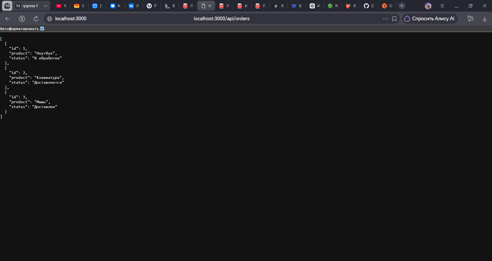

### Список клиентов

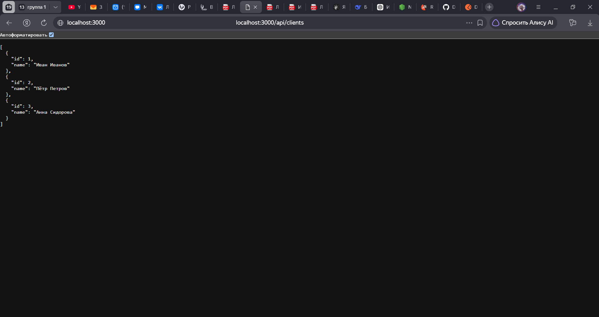

### Параметризированный маршрут


### Обработка 404

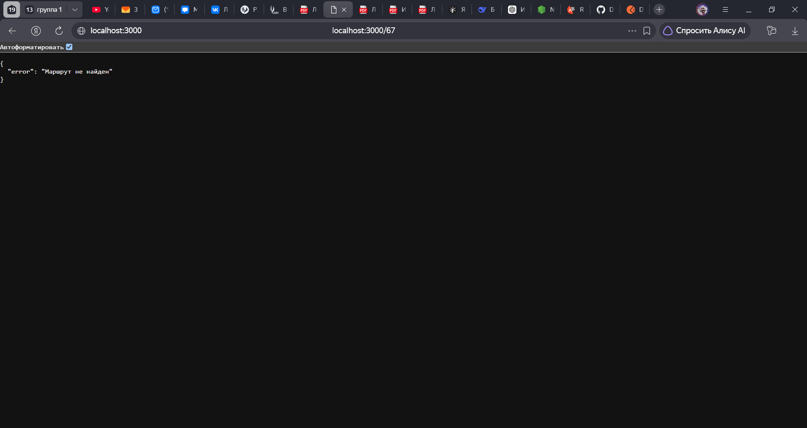

### Логирование

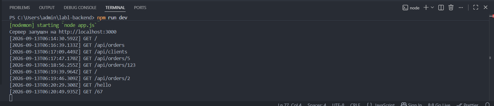

### Автоматический перезапуск

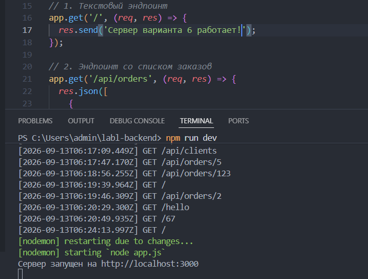
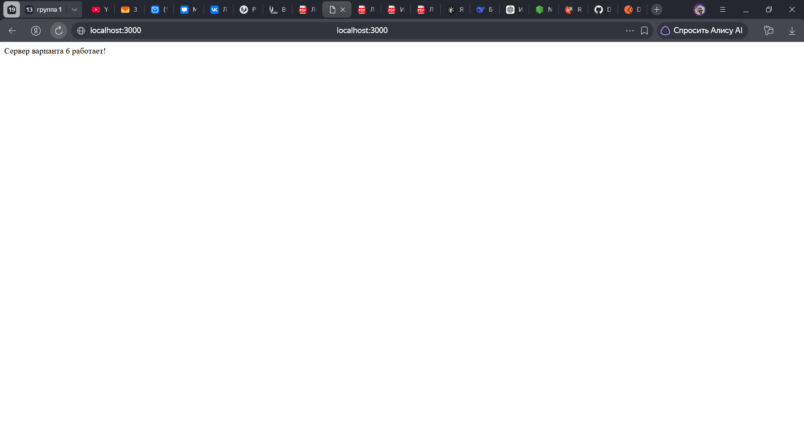

---

## Python + Flask

### Главная страница

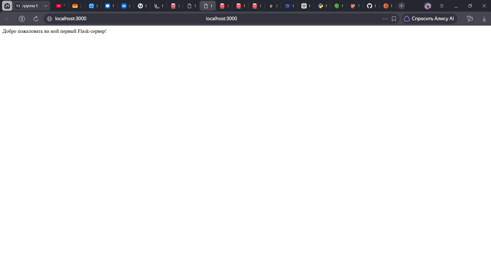

### Список заказов


### Список клиентов


### Параметризированный маршрут

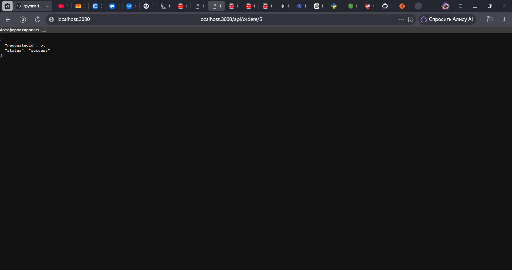

### Обработка 404

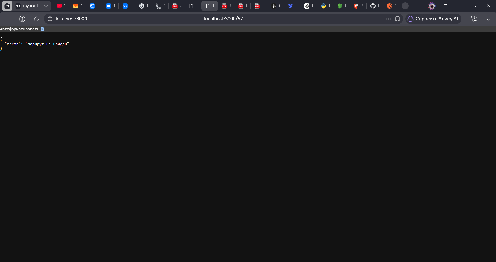

### Логирование

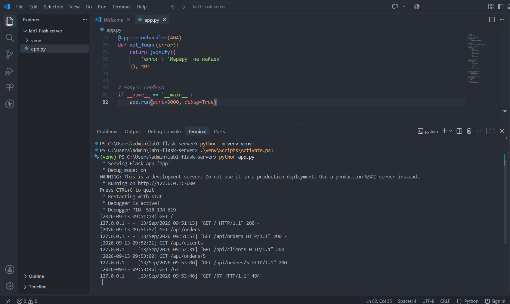

### Автоматический перезапуск

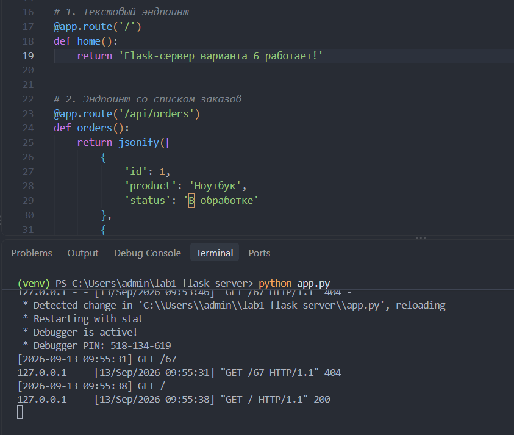
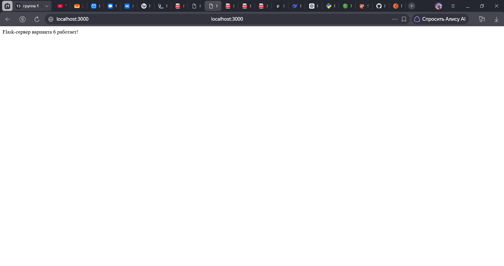

---

# 📝 Вывод

В ходе лабораторной работы был создан простой HTTP-сервер и изучены основные принципы обработки HTTP-запросов.

Были реализованы основные GET-маршруты, возвращающие текстовые и JSON-ответы, параметризированный маршрут для получения данных по идентификатору, обработка ошибки `404`, логирование запросов и автоматический перезапуск приложения при изменении исходного кода.

Практическая часть была выполнена двумя способами: с использованием **Node.js + Express** и **Python + Flask**. Сравнение реализаций показало, что оба подхода позволяют достаточно просто создавать HTTP-серверы и организовывать маршрутизацию, при этом отличаются синтаксисом и используемыми инструментами.

---

## 🚀 Быстрый запуск

### Node.js + Express

```bash
npm install
npm run dev
```

### Python + Flask

```bash
python -m venv venv
.\venv\Scripts\Activate.ps1
python -m pip install -r requirements.txt
python app.py
```

После запуска любого из серверов открыть:

```text
http://localhost:3000
```
