# Лабораторная работа №2. CRUD REST API

> **Студент:** Мамиев Ибрагим Ахмедович
> **Группа:** ПИЖ-б-о-25-2(2) 
> **Лабораторная работа:** №2
> **Вариант:** 6
> **Реализация:** Node.js + Express и CRUD-операции

---

## 📌 Содержание

* [Цель работы](#цель-работы)
* [Используемые технологии](#-используемые-технологии)
* [Структура проекта](#-структура-проекта)
* [Установка и запуск проекта](#установка-и-запуск-проекта)
* [Реализация REST API](#реализация-REST-API)
* [CRUD-операции](#CRUD-операции)
* [Обработка ошибок и валидация](#обработка-ошибок-и-валидация)
* [Дополнительные возможности](#дополнительные-возможности)
* [Продвинутый уровень](#продвинутый-уровень)
* [Тестирование API в Postman](#тестирование-API-в-Postman)
* [Коллекция Postman](#коллекция-Postman)
* [Автоматические тесты](#автоматические-тесты)
* [Collection Runner](#Collection-Runner)
* [Скриншоты запросов](#скриншоты-запросов)
* [Контрольные вопросы](#-контрольные-вопросы)
* [Вывод](#-вывод)
* [Файлы проекта](#файлы-проекта)

---

## 🎯 Цель работы

Цель лабораторной работы — изучить принципы построения REST API на Node.js с использованием фреймворка Express, реализовать CRUD-операции над сущностью «Студент», научиться выполнять HTTP-запросы с помощью Postman и реализовать дополнительные возможности API.

В рамках работы был создан сервер, реализованы основные CRUD-операции, обработка ошибок и валидация данных, а также функции продвинутого уровня: поиск, сортировка, пагинация, частичное обновление, массовые операции, статистика, связанные элементы и логирование запросов.

---

## 🧑‍💻 Используемые технологии

В работе использовались:

* **Node.js** — среда выполнения JavaScript;
* **Express** — фреймворк для создания HTTP-сервера и REST API;
* **npm** — менеджер пакетов;
* **Nodemon** — автоматический перезапуск сервера при изменении исходного кода;
* **Postman** — инструмент для отправки HTTP-запросов и автоматического тестирования API;
* **Git и GitHub** — система контроля версий и хранения проекта.

Версии Node.js и npm:

```text
Node.js: v24.21.0
npm: 11.19.0
```

---

## 📁 Структура проекта

После выполнения лабораторной работы директория `lab2-crud` имеет следующую структуру:

```text
lab2-crud/
├── node_modules/
├── app.js
├── access.log
├── package.json
├── package-lock.json
├── Lab2_CRUD_API.postman_collection.json
├── README.md
│
└── screenshots/
    ├── GET-All-Students.png
    ├── GET-Student-by-ID.png
    ├── ...
    └── access.log.png
```

### Назначение основных файлов

| Файл                                    | Назначение                                   |
| --------------------------------------- | -------------------------------------------- |
| `app.js`                                | основной файл сервера и реализация REST API  |
| `package.json`                          | описание проекта и его зависимостей          |
| `package-lock.json`                     | зафиксированные версии установленных пакетов |
| `access.log`                            | журнал выполненных HTTP-запросов             |
| `Lab2_CRUD_API.postman_collection.json` | экспортированная коллекция запросов Postman  |
| `README.md`                             | отчёт по лабораторной работе                 |

Папка `node_modules` содержит установленные зависимости проекта и не добавляется в Git благодаря `.gitignore`.

---

## Установка и запуск проекта

Для установки зависимостей необходимо перейти в каталог лабораторной работы:

```powershell
cd C:\Users\admin\student-backend-course\lab2-crud
```

Установка зависимостей:

```powershell
npm install
```

Для запуска сервера в режиме разработки используется:

```powershell
npm run dev
```

После успешного запуска сервер становится доступен по адресу:

```text
http://localhost:3000
```

В терминале отображается сообщение:

```text
Сервер запущен на http://localhost:3000
```

Nodemon автоматически перезапускает сервер после изменения исходного кода.

---

## Реализация REST API

В качестве основной сущности используются **студенты**.

Каждый студент имеет следующую структуру:

```json
{
    "id": 1,
    "name": "Иван Иванов",
    "group": "ИВТ-101",
    "course": 2,
    "avg_grade": 4.2
}
```

### Поля студента

| Поле        | Тип    | Описание                 |
| ----------- | ------ | ------------------------ |
| `id`        | number | уникальный идентификатор |
| `name`      | string | имя студента             |
| `group`     | string | учебная группа           |
| `course`    | number | курс обучения            |
| `avg_grade` | number | средний балл             |

Данные хранятся в памяти приложения в массиве `students`.

---

## CRUD-операции

### 1. Получение списка студентов

```http
GET /students
```

Возвращает список всех студентов.

Пример запроса:

```text
GET http://localhost:3000/students
```

Сервер возвращает JSON с количеством записей, параметрами пагинации и массивом студентов.

Скриншот:

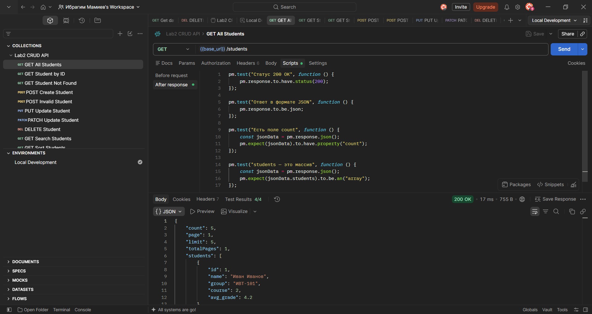

---

### 2. Получение студента по ID

```http
GET /students/:id
```

Пример:

```text
GET http://localhost:3000/students/1
```

При успешном выполнении сервер возвращает данные соответствующего студента.

Скриншот:

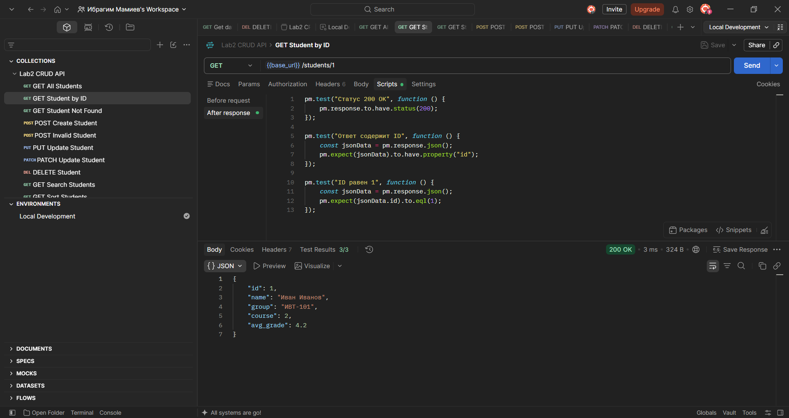

---

### 3. Создание студента

```http
POST /students
```

Данные передаются в формате JSON:

```json
{
    "name": "Алексей Волков",
    "group": "ИВТ-104",
    "course": 2,
    "avg_grade": 4.5
}
```

При успешном создании сервер возвращает статус `201 Created` и созданного студента с автоматически сгенерированным идентификатором.

Скриншот:

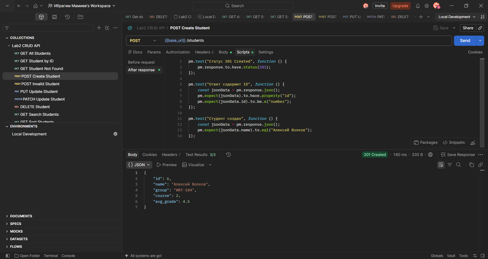

---

### 4. Полное обновление студента

```http
PUT /students/:id
```

Пример:

```text
PUT http://localhost:3000/students/1
```

Для полного обновления передаются все необходимые поля студента.

Скриншот:

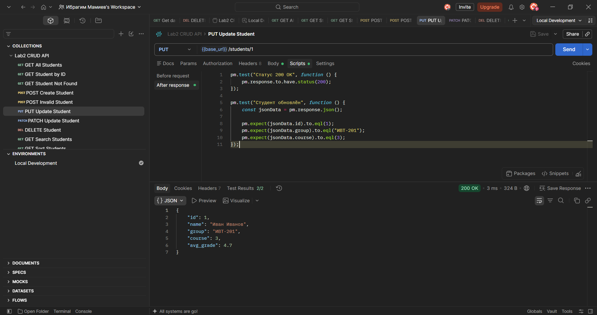

---

### 5. Частичное обновление студента

```http
PATCH /students/:id
```

PATCH позволяет изменить только отдельные поля.

Например:

```json
{
    "avg_grade": 4.9
}
```

При этом остальные данные студента сохраняются.

Скриншот:

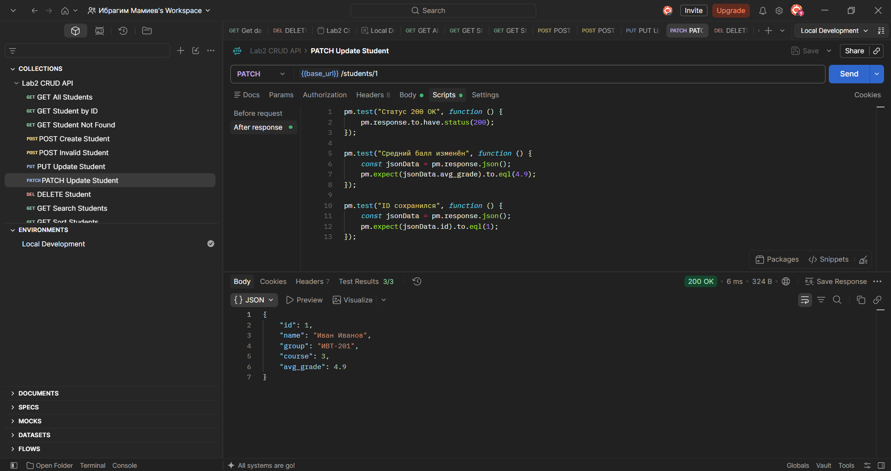

---

### 5.6. Удаление студента

```http
DELETE /students/:id
```

При успешном удалении сервер возвращает:

```text
204 No Content
```

Скриншот:

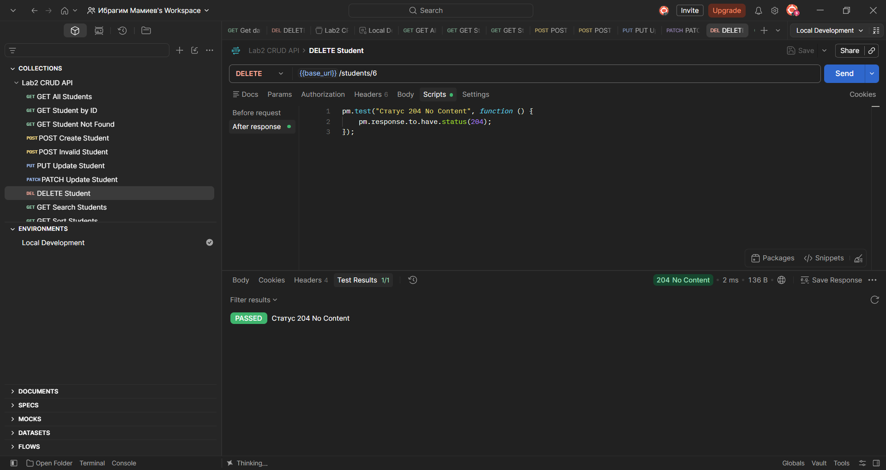

---

## Обработка ошибок и валидация

Для API реализована проверка входных данных.

Проверяется:

* наличие обязательных полей;
* тип данных;
* корректность номера курса;
* допустимый диапазон среднего балла;
* существование студента.

### Ошибка 404

Если студент с указанным ID не найден:

```http
GET /students/999
```

сервер возвращает:

```json
{
    "error": "Студент не найден"
}
```

со статусом:

```text
404 Not Found
```

Скриншот:

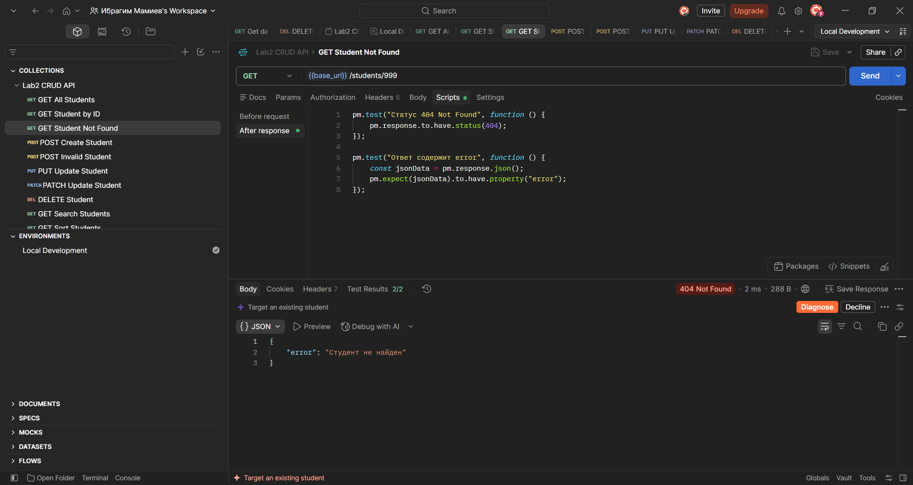

### Ошибка 400

Например, если передать недопустимый номер курса:

```json
{
    "name": "Ошибка",
    "group": "ИВТ-999",
    "course": 10,
    "avg_grade": 4.5
}
```

сервер возвращает ошибку валидации со статусом:

```text
400 Bad Request
```

Скриншот:

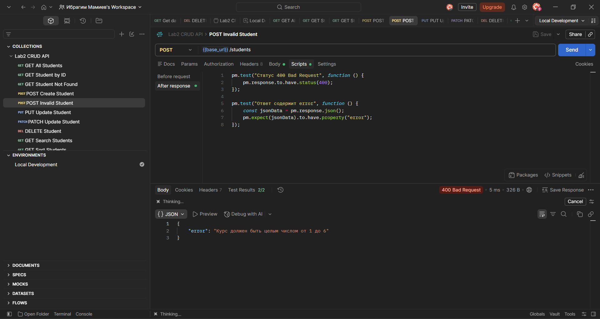

---

# Дополнительные возможности

## 1. Поиск студентов

Для поиска используется query-параметр `search`:

```http
GET /students?search=Иван
```

Поиск выполняется по имени студента.

Скриншот:

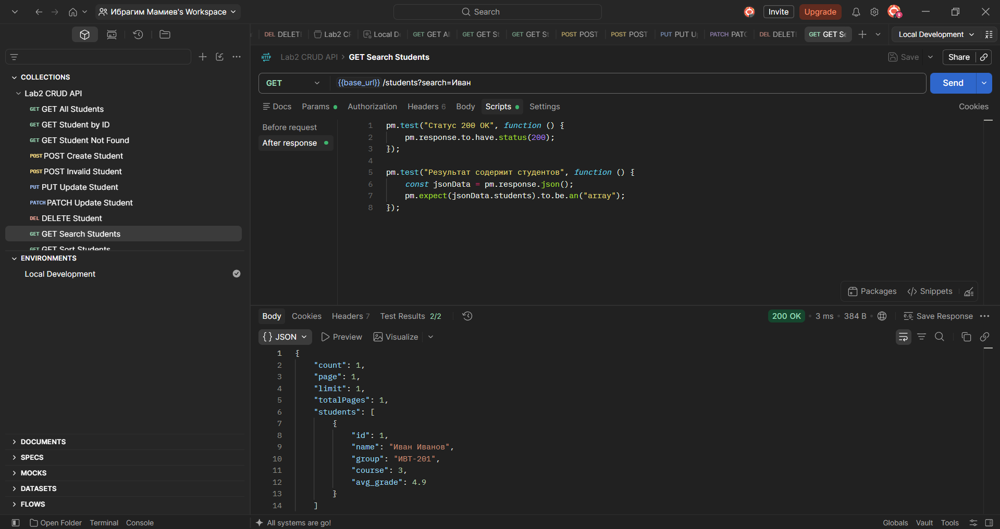

---

## 2. Сортировка

Для сортировки используются параметры `sort` и `order`.

Например:

```http
GET /students?sort=avg_grade&order=desc
```

Возможны направления:

```text
asc
desc
```

Сортировать можно по допустимым полям студента.

Скриншот:

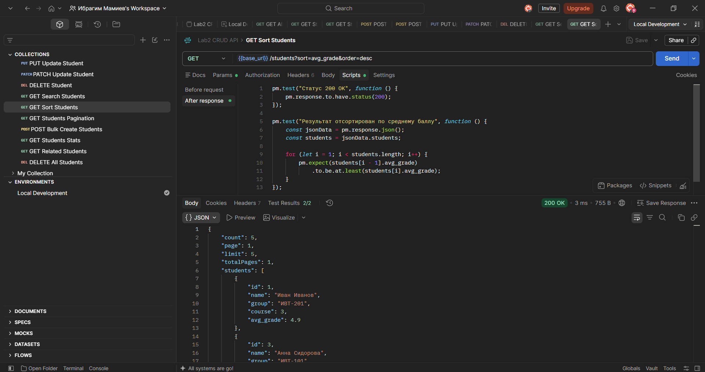

---

## 3. Пагинация

Для постраничного получения данных используются параметры:

```text
page
limit
```

Пример:

```http
GET /students?page=1&limit=2
```

Ответ содержит:

* общее количество студентов;
* номер страницы;
* размер страницы;
* количество страниц;
* массив студентов текущей страницы.

Скриншот:

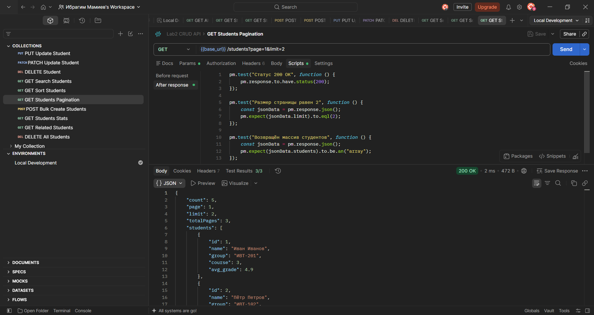

---

# Продвинутый уровень

В рамках продвинутого уровня были реализованы дополнительные возможности REST API.

## 1. Массовое создание

Реализован эндпоинт:

```http
POST /students/bulk
```

Он позволяет создать сразу несколько студентов одним запросом.

Пример:

```json
{
    "students": [
        {
            "name": "Олег Попов",
            "group": "ИВТ-105",
            "course": 1,
            "avg_grade": 4.1
        },
        {
            "name": "Елена Морозова",
            "group": "ИВТ-106",
            "course": 4,
            "avg_grade": 4.9
        }
    ]
}
```

Скриншот:

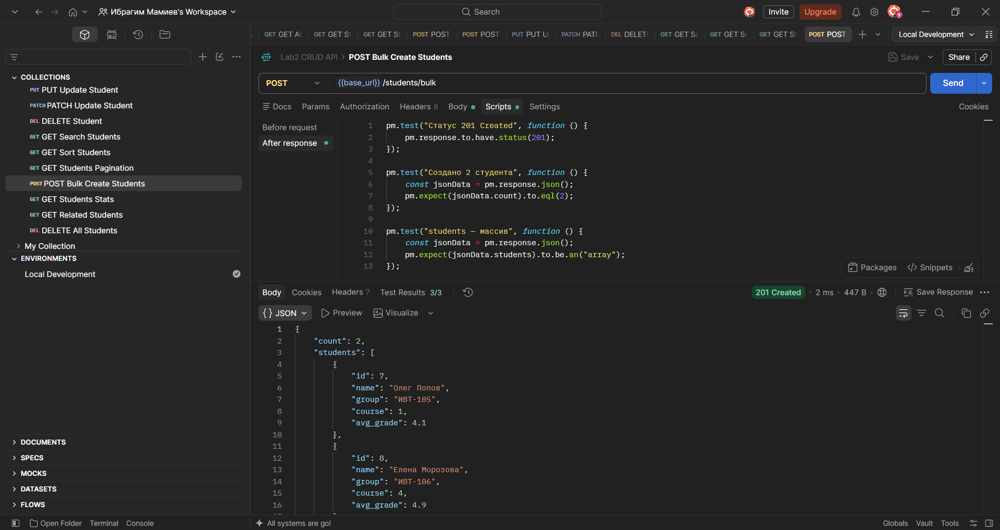

---

## 2. Массовое удаление

Реализован эндпоинт:

```http
DELETE /students
```

Он удаляет всех студентов из хранилища.

Ответ содержит количество удалённых записей.

Пример:

```json
{
    "message": "Все студенты удалены",
    "deletedCount": 7
}
```

Скриншот:

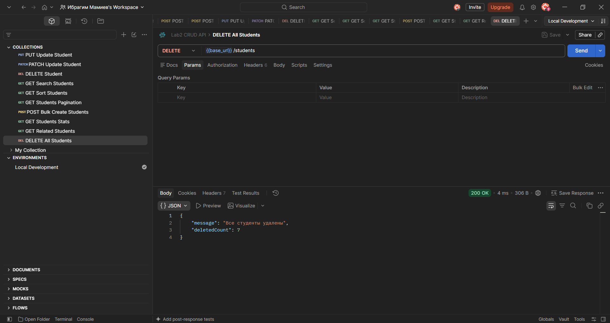

---

## 3. Статистика

Для варианта со студентами реализован дополнительный эндпоинт:

```http
GET /students/stats
```

Он возвращает:

* количество студентов;
* средний балл всех студентов.

Пример:

```json
{
    "count": 5,
    "average_grade": 4.26
}
```

Скриншот:

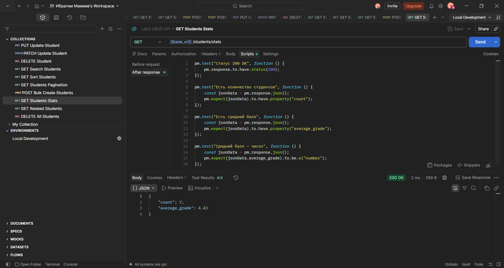

---

## 4. Связанные элементы

Для получения студентов из той же группы реализован эндпоинт:

```http
GET /students/:id/related
```

Например:

```text
GET /students/1/related
```

Ответ содержит группу выбранного студента и массив студентов из той же группы.

Пример:

```json
{
    "student_id": 1,
    "group": "ИВТ-101",
    "related": [
        {
            "id": 3,
            "name": "Анна Сидорова",
            "group": "ИВТ-101",
            "course": 2,
            "avg_grade": 4.8
        }
    ]
}
```

Скриншот:

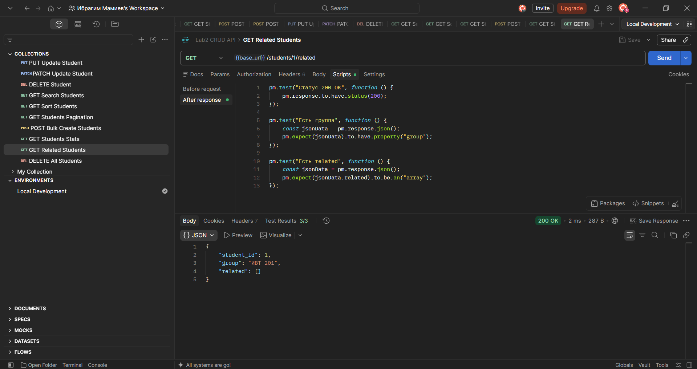

---

## 5. Логирование запросов

Для всех HTTP-запросов реализовано логирование.

Информация записывается в файл:

```text
access.log
```

В журнале сохраняются:

* дата и время запроса;
* HTTP-метод;
* URL;
* HTTP-статус ответа.

Пример:

```text
[2026-09-18T...] GET /students 200
[2026-09-18T...] GET /students/1 200
[2026-09-18T...] GET /students/999 404
[2026-09-18T...] POST /students 201
```

Скриншот:

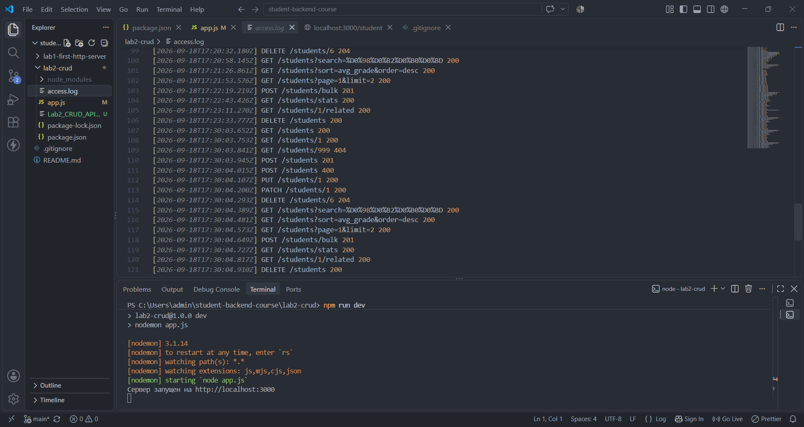

---

# Тестирование API в Postman

Для проверки REST API была создана отдельная коллекция Postman:

```text
Lab2 CRUD API
```

Для удобства используется окружение:

```text
Local Development
```

с переменной:

```text
base_url = http://localhost:3000
```

Благодаря этому URL запросов имеют вид:

```text
{{base_url}}/students
```

вместо повторного указания полного адреса сервера.

---

## Коллекция Postman

В коллекцию были добавлены запросы для всех реализованных операций:

* получение списка студентов;
* получение студента по ID;
* обработка ошибки 404;
* создание студента;
* проверка ошибки 400;
* полное обновление;
* частичное обновление;
* удаление;
* поиск;
* сортировка;
* пагинация;
* массовое создание;
* статистика;
* связанные студенты;
* массовое удаление.

Экспортированная коллекция находится в файле:

```text
Lab2_CRUD_API.postman_collection.json
```

---

## Автоматические тесты

Для запросов Postman были добавлены автоматические проверки.

Проверяются:

* HTTP-статусы;
* формат JSON;
* наличие необходимых полей;
* типы данных;
* корректность результатов отдельных операций.

Результаты тестирования:

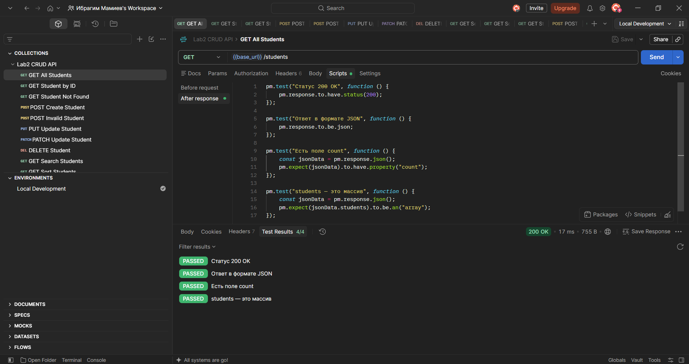

Все тесты завершились со статусом:

```text
PASS
```

---

## Collection Runner

Для запуска всех запросов коллекции использовался **Collection Runner**.

Он позволяет выполнить набор запросов последовательно и получить общий результат автоматического тестирования.

### Список результатов

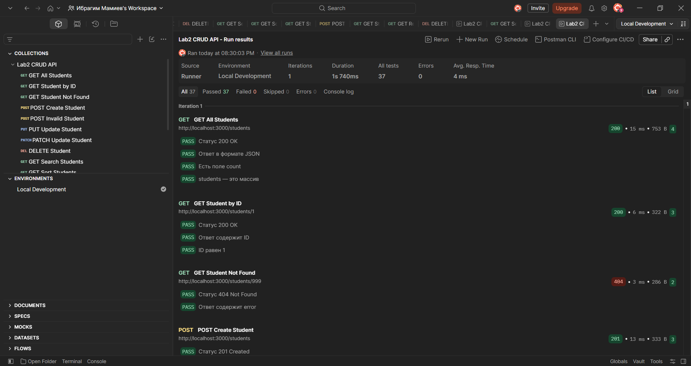

### Сетка результатов

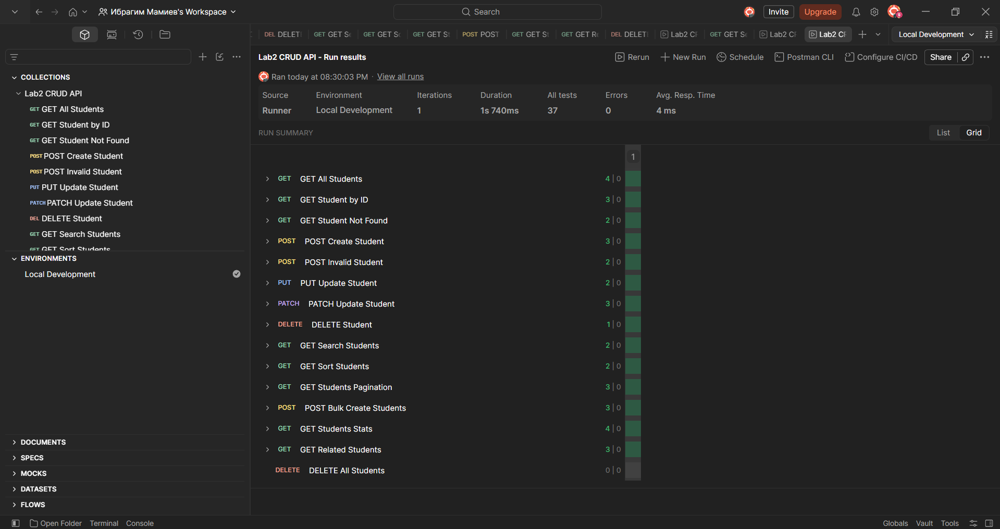

Использование Collection Runner позволяет проверить API сразу по нескольким сценариям и убедиться, что реализованные эндпоинты работают совместно.

---

# Скриншоты запросов

Ниже представлены результаты выполнения основных запросов API.

### Получение всех студентов


### Получение студента по ID


### Ошибка при отсутствии студента


### Создание студента


### Ошибка валидации


### Полное обновление


### Частичное обновление


### Удаление студента


### Поиск


### Сортировка


### Пагинация


### Массовое создание


### Статистика


### Связанные студенты


### Массовое удаление


---

# 📑 Контрольные вопросы


### 1. Что такое CRUD? Какие HTTP-методы соответствуют операциям CRUD?

CRUD — это набор основных операций для работы с данными:

* **Create** — создание;
* **Read** — получение;
* **Update** — изменение;
* **Delete** — удаление.

В REST API им обычно соответствуют:

| CRUD   | HTTP-метод  |
| ------ | ----------- |
| Create | POST        |
| Read   | GET         |
| Update | PUT / PATCH |
| Delete | DELETE      |

В данной лабораторной работе эти операции реализованы для сущности «Студент».

---

### 2. Что такое REST API и какие у него основные принципы?

REST API — это программный интерфейс, построенный на принципах REST и использующий HTTP для взаимодействия между клиентом и сервером.

Основные принципы:

* клиент и сервер разделены;
* запросы являются независимыми и не должны требовать хранения состояния клиента между запросами;
* используются стандартные HTTP-методы;
* ресурсы представлены URL;
* данные обычно передаются в формате JSON;
* сервер возвращает соответствующие HTTP-коды состояния.

В данной работе ресурсом является студент, а его URL представлены маршрутами `/students` и `/students/:id`.

---

### 3. Какие HTTP-коды используются для успешных операций и ошибок?

В работе используются следующие коды:

| Код                         | Назначение                        |
| --------------------------- | --------------------------------- |
| `200 OK`                    | успешное выполнение запроса       |
| `201 Created`               | успешное создание ресурса         |
| `204 No Content`            | успешное удаление без тела ответа |
| `400 Bad Request`           | некорректные входные данные       |
| `404 Not Found`             | ресурс не найден                  |
| `500 Internal Server Error` | внутренняя ошибка сервера         |

---

### 4. Чем отличаются PUT и PATCH?

**PUT** используется для полного обновления ресурса. Клиент передаёт полный набор данных, необходимых для формирования новой версии объекта.

**PATCH** предназначен для частичного обновления. Можно передать только те поля, которые необходимо изменить.

Например, для изменения только среднего балла:

```json
{
    "avg_grade": 4.9
}
```

используется PATCH.

---

### 5. Что такое middleware в Express?

Middleware — это функция, которая выполняется в процессе обработки HTTP-запроса и может:

* анализировать запрос;
* изменять объект запроса или ответа;
* выполнять дополнительные действия;
* передавать управление следующему обработчику.

В данной работе middleware используется для обработки JSON:

```javascript
app.use(express.json());
```

а также для логирования HTTP-запросов.

---

### 6. Зачем нужна валидация входных данных?

Валидация необходима для проверки того, что клиент передал корректные данные.

В данной работе проверяются:

* обязательные поля;
* типы данных;
* диапазон курса;
* диапазон среднего балла.

Если данные некорректны, сервер возвращает:

```text
400 Bad Request
```

с описанием ошибки.

---

### 7. Что такое query-параметры?

Query-параметры — это параметры, которые передаются после символа `?` в URL.

Например:

```text
/students?search=Иван
```

Здесь:

```text
search=Иван
```

является query-параметром.

В работе query-параметры используются для:

* поиска;
* сортировки;
* пагинации.

Например:

```text
/students?sort=avg_grade&order=desc
```

---

### 8. Для чего нужна пагинация?

Пагинация позволяет разделить большой набор данных на несколько небольших страниц.

В работе используются параметры:

```text
page
limit
```

Например:

```text
/students?page=1&limit=2
```

Это позволяет получить только определённое количество студентов и уменьшить объём одного ответа.

---

### 9. Для чего нужны автоматические тесты в Postman?

Автоматические тесты позволяют проверять API без необходимости вручную анализировать каждый ответ.

В работе тесты проверяют:

* HTTP-статусы;
* формат JSON;
* наличие полей;
* типы данных;
* корректность отдельных результатов.

После запуска запроса Postman показывает результаты в разделе `Test Results`.

---

### 10. Для чего используется Collection Runner?

Collection Runner позволяет последовательно выполнить несколько запросов из одной коллекции.

Это удобно для комплексной проверки API, поскольку можно запустить все подготовленные сценарии и получить общий результат выполнения тестов.

В данной лабораторной Collection Runner использовался для проверки всей коллекции `Lab2 CRUD API`.

---

## 📝 Вывод

В ходе лабораторной работы был разработан REST API на Node.js с использованием Express.

Были реализованы основные CRUD-операции для сущности «Студент»:

* получение списка;
* получение элемента по ID;
* создание;
* полное обновление;
* частичное обновление;
* удаление.

Также была реализована обработка ошибок и валидация входных данных.

В рамках продвинутого уровня добавлены:

* поиск;
* сортировка;
* пагинация;
* массовое создание;
* массовое удаление;
* PATCH;
* статистика;
* получение связанных студентов;
* логирование запросов.

Для тестирования API была создана коллекция Postman с автоматическими тестами. С помощью Test Results и Collection Runner проверена корректность работы реализованных эндпоинтов.

Таким образом, в ходе работы были получены практические навыки создания REST API, работы с HTTP-методами, обработки JSON-данных, валидации запросов и автоматизированного тестирования API.

---

## Файлы проекта

Основные файлы лабораторной работы:

```text
app.js
package.json
package-lock.json
access.log
Lab2_CRUD_API.postman_collection.json
README.md
```

Экспортированная коллекция Postman:

```text
Lab2_CRUD_API.postman_collection.json
```

используется для повторного запуска и тестирования всех подготовленных API-запросов.
