# 🔀 Лабораторная работа №3 — Маршрутизация и параметры запросов

> **Студент:** Мамиев Ибрагим Ахмедович
> **Группа:** ПИЖ-б-о-25-2(2) 
> **Лабораторная работа:** №3

В третьей лабораторной работе рассматривается создание REST API на основе **Express.js** с использованием параметров маршрутов, query-параметров, вложенных маршрутов и различных способов фильтрации и обработки запросов.

В рамках работы реализовано API для работы с двумя связанными сущностями — **заказами и клиентами**.

**Вариант:** 6
**Уровень:** Продвинутый

---

## 📌 Содержание

* [📚 Цель работы](#-цель-работы)
* [🛠️ Используемые технологии](#-используемые-технологии)
* [📦 Структура проекта](#-структура-проекта)
* [🧩 Используемые сущности](#-используемые-сущности)
* [🚀 Запуск проекта](#-запуск-проекта)
* [🛣️ Маршрутизация](#-маршрутизация)
* [⚙️ Параметры маршрута](#-параметры-маршрута)
* [❌ Обработка отсутствующих ресурсов](#-обработка-отсутствующих-ресурсов)
* [🔗 Вложенные маршруты](#-вложенные-маршруты)
* [🔗 Маршрут с несколькими параметрами](#-маршрут-с-несколькими-параметрами)

* [🔎 Поиск](#-поиск)
* [↕️ Сортировка
](#-сортировка)
* [📄 Пагинация](#-пагинация)
* [🏷️ Фильтрация](#-фильтрация)
* [🔗 Связь заказов по статусу](#-связь-заказов-по-статусу)
* [📊 Статистика](#-статистика)
* [🚫 Обработка неизвестных маршрутов](#-обработка-неизвестных-маршрутов)
* [⚠️ Обработка ошибок сервера](#-обработка-ошибок-сервера)
* [📝 Логирование запросов](#-логирование-запросов)
* [🧪 Тестирование API в Postman](#-тестирование-API-в-Postman)
* [📋 Основные endpoints](#-основные-endpoints)
* [📊 Поддерживаемые query-параметры](#-поддерживаемыепquery-параметры)
* [🔐 Валидация](#-валидация)
* [📖 Контрольные вопросы](#-контрольные-вопросы)
* [📁 Файлы проекта](#-файлы-проекта)
* [✅ Результат работы](#-результат-работы)


---

## 📚 Цель работы

Цель лабораторной работы — изучить возможности маршрутизации в **Express.js**, научиться работать с параметрами URL и query-параметрами, реализовать вложенные маршруты, фильтрацию, сортировку и пагинацию, а также освоить обработку ошибок и создание статистических endpoints.

---

## 🛠️ Используемые технологии

| Технология       | Назначение                         |
| ---------------- | ---------------------------------- |
| **Node.js**      | Среда выполнения JavaScript        |
| **Express.js**   | Создание HTTP-сервера и REST API   |
| **Postman**      | Тестирование API                   |
| **Nodemon**      | Автоматический перезапуск сервера  |
| **Git / GitHub** | Контроль версий и хранение проекта |

---

## 📦 Структура проекта

```text
lab3-routing-params/
├── app.js
├── package.json
├── package-lock.json
├── Lab3_Orders.postman_collection.json
├── README.md
└── screenshots/
    ├── 01-orders-all.png
    ├── 02-order-by-id.png
    ├── 03-order-400.png
    ├── 04-order-404.png
    ├── 05-order-client.png
    ├── 06-client-orders.png
    ├── 07-multi-params.png
    ├── 08-search.png
    ├── 09-sort.png
    ├── 10-pagination.png
    ├── 11-filter.png
    ├── 12-status-orders.png
    ├── 13-stats.png
    ├── 14-wildcard-404.png
    └── 15-error-500.png
```

---

## 🧩 Используемые сущности

В лабораторной работе используются две связанные сущности.

### Заказы

Каждый заказ содержит:

```json
{
    "id": 1,
    "clientId": 1,
    "product": "Ноутбук ASUS",
    "amount": 85000,
    "status": "completed",
    "date": "2026-09-01"
}
```

### Клиенты

Каждый клиент содержит:

```json
{
    "id": 1,
    "name": "Иван Петров",
    "email": "ivan.petrov@example.com",
    "city": "Москва"
}
```

### Статусы заказов

Для фильтрации используются следующие статусы:

* `pending` — ожидает обработки;
* `processing` — находится в обработке;
* `completed` — выполнен;
* `cancelled` — отменён.

---

# 🚀 Запуск проекта

## Установка зависимостей

Перейти в директорию лабораторной работы:

```bash
cd lab3-routing-params
```

Установить зависимости:

```bash
npm install
```

## Запуск в обычном режиме

```bash
npm start
```

## Запуск в режиме разработки

Для автоматического перезапуска сервера используется **Nodemon**:

```bash
npm run dev
```

После запуска сервер доступен по адресу:

```text
http://localhost:3000
```

При успешном запуске в консоли отображается:

```text
==========================================
Лабораторная работа №3
Express Routing API
Сервер запущен: http://localhost:3000
==========================================
```

---

# 🛣️ Маршрутизация

Основная часть лабораторной работы посвящена маршрутизации Express.js.

## Получение всех заказов

```http
GET /orders
```

Возвращает список заказов.

Также поддерживаются query-параметры:

```text
search
sort
order
page
limit
filter
status
```

### Пример

```http
GET /orders?status=completed
```

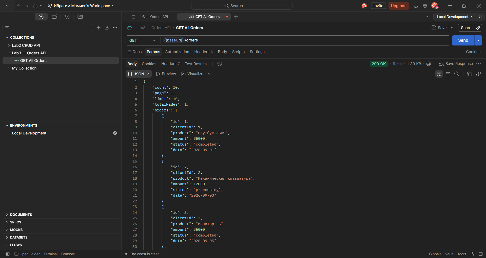

---

## Получение заказа по ID

```http
GET /orders/:id
```

### Пример

```http
GET /orders/1
```

Возвращается информация о конкретном заказе.

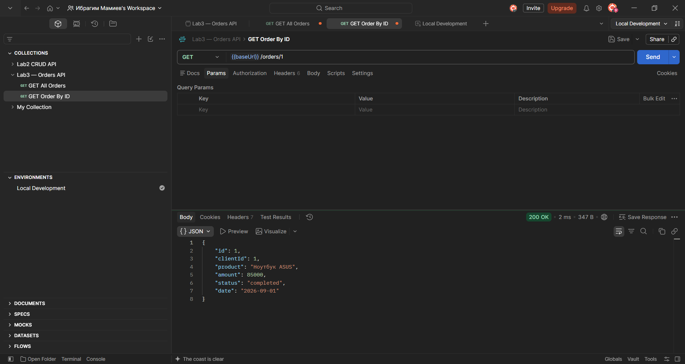

---

# ⚙️ Параметры маршрута

Параметры маршрута позволяют передавать значения непосредственно в URL.

Например:

```http
GET /orders/:id
```

Значение параметра доступно через:

```javascript
req.params.id
```

В лабораторной работе реализована проверка параметра `id`.

При передаче некорректного значения:

```http
GET /orders/abc
```

сервер возвращает:

```json
{
    "error": "ID заказа должен быть положительным целым числом"
}
```

HTTP-код:

```text
400 Bad Request
```

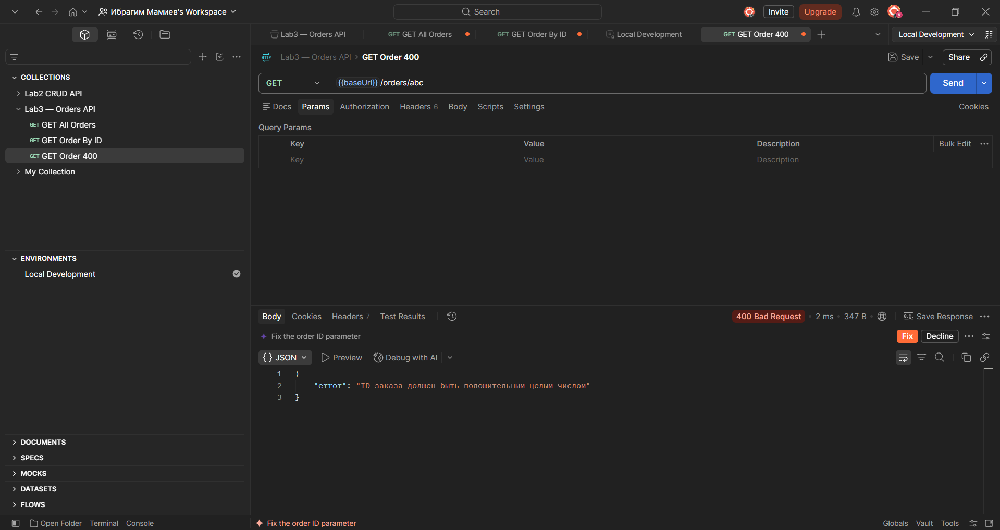

---

# ❌ Обработка отсутствующих ресурсов

Если заказ с указанным идентификатором отсутствует:

```http
GET /orders/999
```

сервер возвращает:

```json
{
    "error": "Заказ не найден"
}
```

HTTP-код:

```text
404 Not Found
```

.png)

---

# 🔗 Вложенные маршруты

Для работы со связанными сущностями используются вложенные маршруты.

## Клиент конкретного заказа

```http
GET /orders/:id/client
```

### Пример

```http
GET /orders/1/client
```

Маршрут позволяет получить клиента, которому принадлежит указанный заказ.

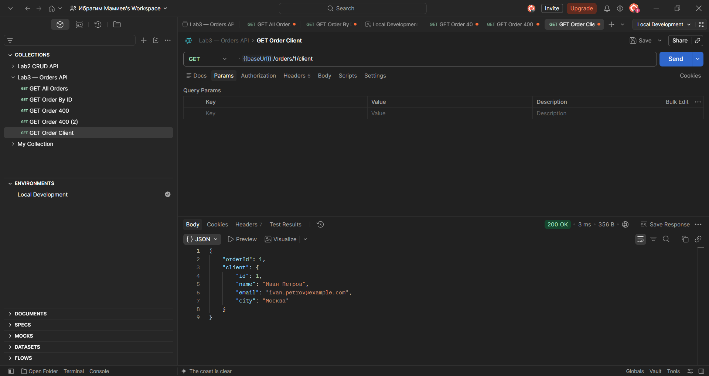

---

## Все заказы клиента

```http
GET /clients/:clientId/orders
```

### Пример

```http
GET /clients/1/orders
```

В ответе возвращается информация о клиенте и список всех его заказов.

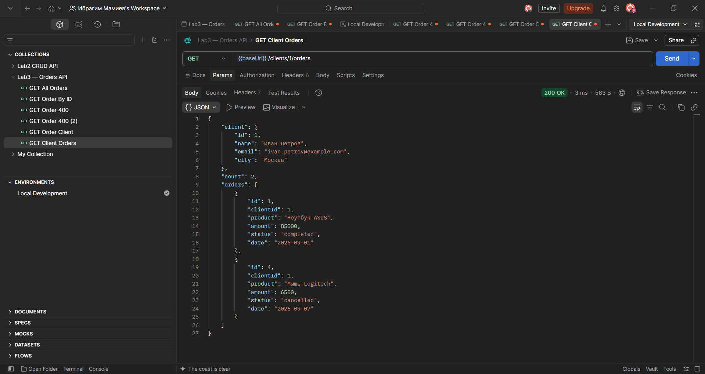

---

# 🔗 Маршрут с несколькими параметрами

В лабораторной работе также реализован маршрут с двумя параметрами:

```http
GET /clients/:clientId/orders/:orderId
```

### Пример

```http
GET /clients/1/orders/1
```

При обработке проверяется:

1. существование клиента;
2. существование заказа;
3. принадлежность заказа указанному клиенту.

Таким образом, маршрут позволяет работать с конкретным заказом конкретного клиента.

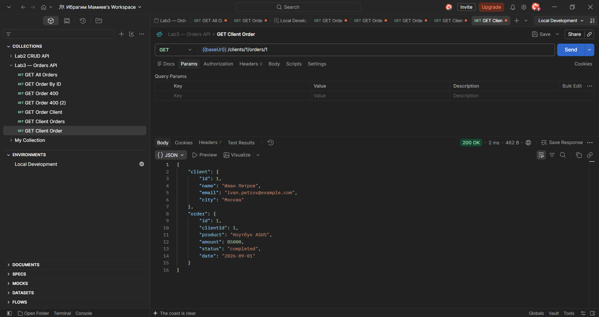

---

# 🔎 Поиск

Для поиска заказов используется query-параметр `search`.

```http
GET /orders?search=Ноутбук
```

Поиск выполняется по названию товара.

Пример:

```text
GET /orders?search=Ноутбук
```

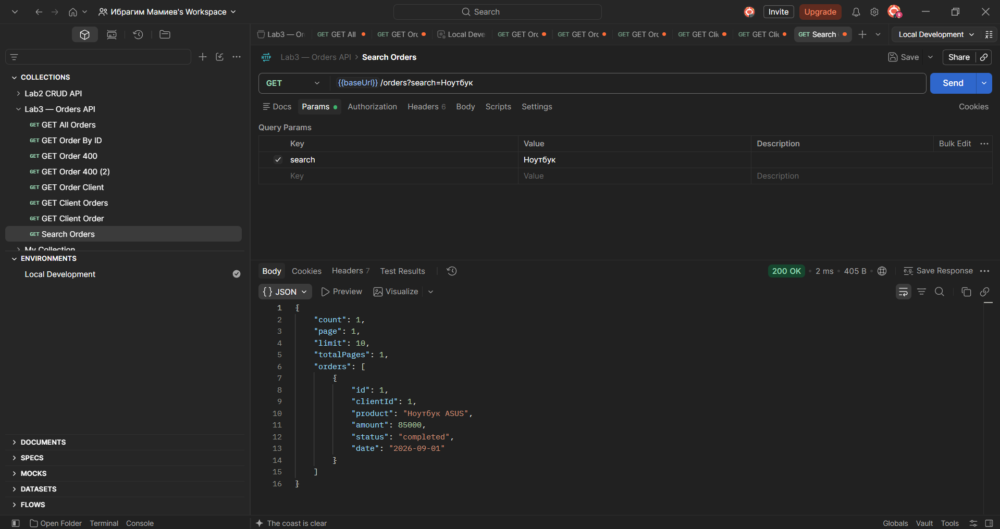

---

# ↕️ Сортировка

API поддерживает сортировку результатов.

Используются параметры:

```text
sort
order
```

### Пример

```http
GET /orders?sort=amount&order=desc
```

где:

* `sort` — поле сортировки;
* `order=asc` — сортировка по возрастанию;
* `order=desc` — сортировка по убыванию.

Разрешённые поля сортировки:

```text
id
amount
product
status
date
clientId
```

Использование списка разрешённых полей предотвращает сортировку по произвольным значениям.

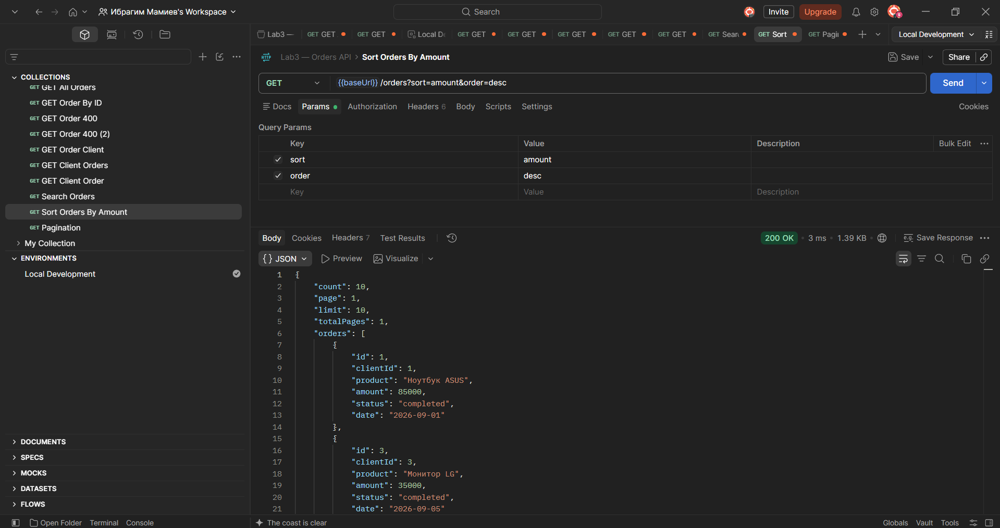

---

# 📄 Пагинация

Для постраничного получения данных используются параметры:

```text
page
limit
```

### Пример

```http
GET /orders?page=1&limit=3
```

где:

* `page` — номер страницы;
* `limit` — количество элементов на странице.

Ответ дополнительно содержит:

* общее количество элементов;
* номер текущей страницы;
* размер страницы;
* общее количество страниц.

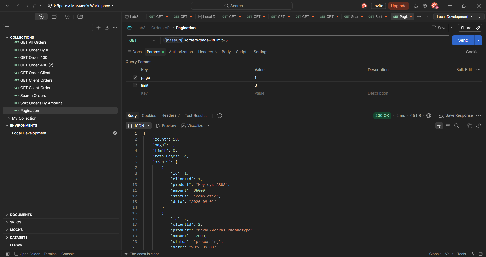

---

# 🏷️ Фильтрация

Для фильтрации заказов по статусу используется параметр:

```text
status
```

### Пример

```http
GET /orders?status=completed
```

Также реализован универсальный формат:

```text
filter=field:value
```

Например:

```http
GET /orders?filter=status:completed
```

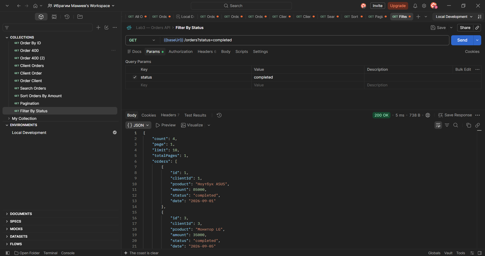

---

# 🔗 Связь заказов по статусу

Для варианта №6 реализован отдельный маршрут:

```http
GET /statuses/:status/orders
```

### Пример

```http
GET /statuses/completed/orders
```

Маршрут возвращает все заказы с указанным статусом.

Поддерживаются:

```text
pending
processing
completed
cancelled
```

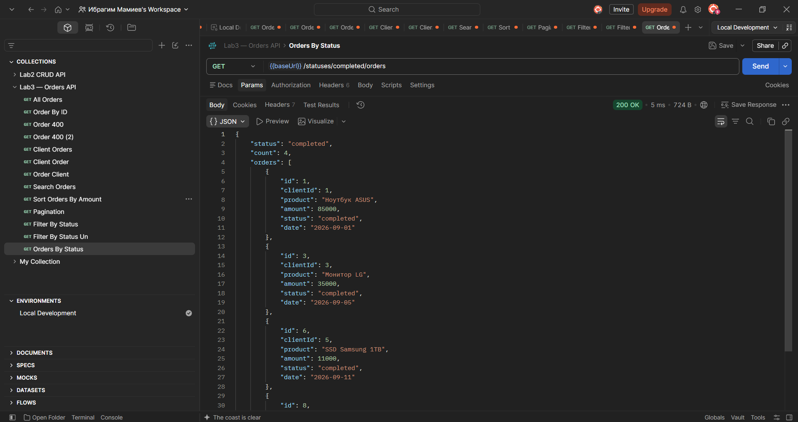

---

# 📊 Статистика

Для получения статистики реализован endpoint:

```http
GET /orders/stats
```

Он возвращает:

* количество заказов;
* общую сумму заказов;
* среднюю стоимость заказа;
* минимальную стоимость;
* максимальную стоимость;
* количество заказов по каждому статусу.

### Пример ответа

```json
{
    "count": 10,
    "totalAmount": 215500,
    "averageAmount": 21550,
    "minAmount": 4500,
    "maxAmount": 85000,
    "byStatus": {
        "pending": 2,
        "processing": 3,
        "completed": 4,
        "cancelled": 1
    }
}
```

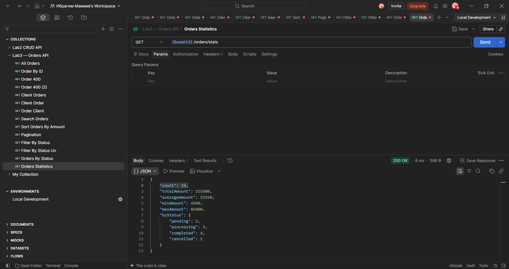

---

# 🚫 Обработка неизвестных маршрутов

Для обработки запросов к несуществующим endpoints реализован глобальный обработчик `404`.

Например:

```http
GET /something-that-does-not-exist
```

Сервер возвращает:

```json
{
    "error": "Маршрут не найден",
    "method": "GET",
    "url": "/something-that-does-not-exist"
}
```

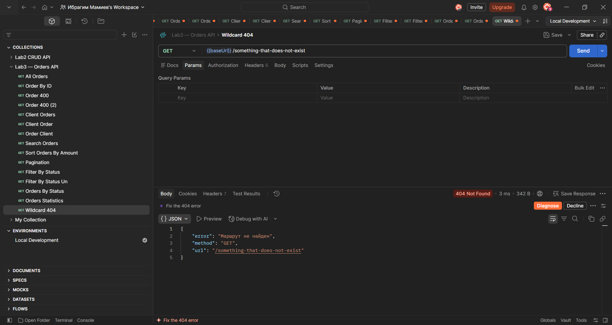

---

# ⚠️ Обработка ошибок сервера

В приложении реализован глобальный обработчик ошибок `500`.

Для проверки используется специальный endpoint:

```http
GET /test/error
```

В результате сервер возвращает:

```json
{
    "error": "Внутренняя ошибка сервера",
    "message": "Тестовая ошибка сервера"
}
```

HTTP-код:

```text
500 Internal Server Error
```

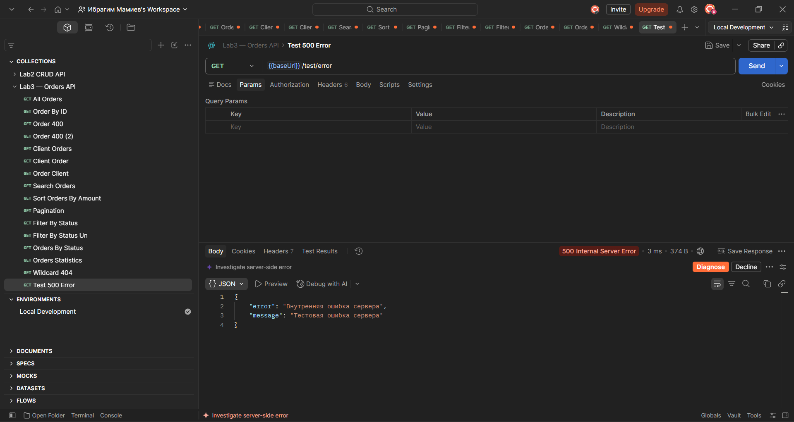

---

# 📝 Логирование запросов

Для каждого входящего HTTP-запроса сервер выводит в консоль:

* время запроса;
* HTTP-метод;
* URL;
* IP-адрес клиента.

Пример:

```text
[2026-09-23T18:20:10.123Z] GET /orders | IP: ::1
[2026-09-23T18:20:14.532Z] GET /orders/1 | IP: ::1
[2026-09-23T18:20:18.213Z] GET /orders/stats | IP: ::1
```

Логирование реализовано с помощью middleware Express:

```javascript
app.use((req, res, next) => {
    const timestamp = new Date().toISOString();
    const ip = req.ip;

    console.log(
        `[${timestamp}] ${req.method} ${req.originalUrl} | IP: ${ip}`
    );

    next();
});
```

---

# 🧪 Тестирование API в Postman

Для тестирования разработана отдельная коллекция Postman:

📄 [`Lab3_Orders.postman_collection.json`](Lab3_Orders.postman_collection.json)

Коллекция содержит основные сценарии проверки API:

| №  | Запрос                                   | Назначение                       |
| -- | ---------------------------------------- | -------------------------------- |
| 01 | `GET /orders`                            | Получение всех заказов           |
| 02 | `GET /orders/:id`                        | Получение заказа                 |
| 03 | `GET /orders/abc`                        | Проверка `400`                   |
| 04 | `GET /orders/999`                        | Проверка `404`                   |
| 05 | `GET /orders/:id/client`                 | Получение клиента заказа         |
| 06 | `GET /clients/:clientId/orders`          | Заказы клиента                   |
| 07 | `GET /clients/:clientId/orders/:orderId` | Работа с несколькими параметрами |
| 08 | `GET /orders?search=...`                 | Поиск                            |
| 09 | `GET /orders?sort=...`                   | Сортировка                       |
| 10 | `GET /orders?page=...&limit=...`         | Пагинация                        |
| 11 | `GET /orders?status=...`                 | Фильтрация                       |
| 12 | `GET /statuses/:status/orders`           | Получение заказов по статусу     |
| 13 | `GET /orders/stats`                      | Статистика                       |
| 14 | Неизвестный URL                          | Проверка `404`                   |
| 15 | `GET /test/error`                        | Проверка `500`                   |

---

# 📋 Основные endpoints

| Метод | Endpoint                             | Назначение                 |
| ----- | ------------------------------------ | -------------------------- |
| `GET` | `/orders`                            | Получить список заказов    |
| `GET` | `/orders/:id`                        | Получить заказ по ID       |
| `GET` | `/orders/:id/client`                 | Получить клиента заказа    |
| `GET` | `/clients/:clientId`                 | Получить клиента           |
| `GET` | `/clients/:clientId/orders`          | Получить заказы клиента    |
| `GET` | `/clients/:clientId/orders/:orderId` | Получить заказ клиента     |
| `GET` | `/statuses/:status/orders`           | Получить заказы по статусу |
| `GET` | `/orders/stats`                      | Получить статистику        |
| `GET` | `/test/error`                        | Проверить обработку `500`  |

---

# 📊 Поддерживаемые query-параметры

Endpoint:

```http
GET /orders
```

поддерживает следующие параметры:

| Параметр | Пример                    | Назначение               |
| -------- | ------------------------- | ------------------------ |
| `search` | `search=Ноутбук`          | Поиск                    |
| `sort`   | `sort=amount`             | Поле сортировки          |
| `order`  | `order=desc`              | Направление сортировки   |
| `page`   | `page=1`                  | Номер страницы           |
| `limit`  | `limit=3`                 | Количество элементов     |
| `status` | `status=completed`        | Фильтрация по статусу    |
| `filter` | `filter=status:completed` | Универсальная фильтрация |

Параметры проходят валидацию перед обработкой запроса.

---

# 🔐 Валидация

В приложении реализована проверка входных параметров.

Проверяется:

* корректность ID;
* существование клиента;
* существование заказа;
* принадлежность заказа клиенту;
* допустимость статуса;
* допустимость поля сортировки;
* направление сортировки;
* номер страницы;
* количество элементов на странице;
* формат фильтра;
* значения фильтров.

Для некорректных параметров возвращается:

```text
400 Bad Request
```

Для отсутствующих ресурсов:

```text
404 Not Found
```

Для внутренних ошибок:

```text
500 Internal Server Error
```

---

# 📖 Контрольные вопросы

<details>
<summary><strong>🟢 Базовый уровень — вопросы 1–10</strong></summary>

<br>

### 1. Что такое маршрутизация? Как она работает в Express/Flask?

**Маршрутизация** — это механизм определения того, какой обработчик должен быть выполнен для конкретного HTTP-запроса.

В **Express.js** маршрут определяется HTTP-методом и URL:

```javascript
app.get('/orders', (req, res) => {
    res.json(orders);
});
```

В данном случае запрос:

```text
GET /orders
```

будет передан указанному обработчику.

Во **Flask** маршруты определяются с помощью декоратора:

```python
@app.route('/orders', methods=['GET'])
def get_orders():
    return jsonify(orders)
```

Таким образом, в обоих фреймворках маршрутизация связывает URL и HTTP-метод с определённой функцией обработки запроса.

---

### 2. Чем отличаются `req.params`, `req.query` и `req.body`?

Это три разных способа получения данных из HTTP-запроса в Express.

| Источник     | Назначение          | Пример           |
| ------------ | ------------------- | ---------------- |
| `req.params` | Параметры пути      | `/orders/15`     |
| `req.query`  | Query-параметры     | `/orders?page=2` |
| `req.body`   | Данные тела запроса | JSON при `POST`  |

Например:

```text
GET /orders/15?page=2
```

`15` находится в:

```javascript
req.params.id
```

а `2`:

```javascript
req.query.page
```

Для JSON-тела запроса используется:

```javascript
req.body
```

---

### 3. Как получить параметр пути в Express? Во Flask?

В Express параметр объявляется через `:`:

```javascript
app.get('/orders/:id', (req, res) => {
    const id = req.params.id;
});
```

Во Flask параметр указывается непосредственно в маршруте:

```python
@app.route('/orders/<int:id>')
def get_order(id):
    ...
```

Таким образом:

**Express:**

```javascript
req.params.id
```

**Flask:**

```python
id
```

---

### 4. Что произойдёт, если не преобразовать параметр пути в число?

В Express параметры маршрута изначально являются **строками**.

Например:

```javascript
app.get('/orders/:id', (req, res) => {
    console.log(typeof req.params.id);
});
```

При запросе:

```text
/orders/5
```

результатом будет:

```text
string
```

Если использовать такой параметр в математических операциях или сравнениях, это может привести к неожиданному поведению.

Поэтому числовые параметры следует явно преобразовывать:

```javascript
const id = Number(req.params.id);
```

После этого необходимо проверить, что значение действительно является допустимым числом.

---

### 5. Как обработать ситуацию, когда параметр пути отсутствует?

Если маршрут объявлен как:

```javascript
app.get('/orders/:id', ...)
```

то `/orders` и `/orders/5` — это разные маршруты.

Запрос:

```text
GET /orders
```

не будет соответствовать маршруту `/orders/:id`.

Для обработки такого случая можно определить отдельный маршрут:

```javascript
app.get('/orders', ...)
```

А если параметр логически необязательный, в Express 5 лучше проектировать отдельные маршруты или использовать query-параметр.

---

### 6. Что такое вложенные маршруты? Приведите пример.

**Вложенный маршрут** представляет связь между несколькими ресурсами.

Например:

```text
GET /clients/5/orders
```

означает получение заказов клиента с ID `5`.

Другой пример:

```text
GET /clients/5/orders/12
```

позволяет обратиться к заказу `12`, принадлежащему клиенту `5`.

Такие маршруты удобно использовать для представления отношений между сущностями.

---

### 7. Какой код ответа возвращается, если ресурс не найден?

Если запрошенный ресурс отсутствует, обычно используется:

```text
404 Not Found
```

Например:

```text
GET /orders/999
```

если заказа с таким ID нет.

---

### 8. Какой код ответа возвращается при невалидном параметре?

Если параметр передан, но имеет недопустимый формат или значение, используется:

```text
400 Bad Request
```

Например:

```text
GET /orders/abc
```

если API ожидает положительное целое число.

---

### 9. Как объявить необязательный параметр пути в Express?

В современных версиях Express 5 синтаксис необязательных параметров отличается от старых версий Express.

На практике для необязательных значений часто удобнее использовать query-параметр:

```text
/orders?id=5
```

вместо попытки сделать параметр пути необязательным.

Это делает структуру API более понятной и позволяет отдельно обрабатывать `/orders` и `/orders/:id`.

---

### 10. Как работает порядок объявления маршрутов в Express? Почему он важен?

Express проверяет маршруты в порядке их объявления.

Например, если сначала объявить слишком общий маршрут:

```javascript
app.get('/orders/:id', ...);
```

а затем специальный:

```javascript
app.get('/orders/stats', ...);
```

то запрос:

```text
/orders/stats
```

может быть воспринят как запрос к `/orders/:id` со значением:

```text
id = "stats"
```

Поэтому специальные маршруты необходимо объявлять **до параметризованных**, например:

```javascript
app.get('/orders/stats', ...);
app.get('/orders/:id', ...);
```

Это особенно важно для маршрутов вроде:

```text
/orders/stats
/orders/search
/orders/:id
```

---

</details>

<br>

<details>
<summary><strong>🟡 Средний уровень — вопросы 11–20</strong></summary>

<br>

### 11. Как получить query-параметры в Express/Flask? Чем они отличаются от параметров пути?

В Express query-параметры находятся в:

```javascript
req.query
```

Например:

```text
/orders?page=2&limit=10
```

получаются следующим образом:

```javascript
req.query.page
req.query.limit
```

Параметр пути находится в:

```javascript
req.params
```

Например:

```text
/orders/15
```

получаем:

```javascript
req.params.id
```

Во Flask query-параметры обычно получают через:

```python
request.args.get('page')
```

Основное отличие:

* параметр пути является частью структуры URL;
* query-параметр передаёт дополнительные условия запроса.

---

### 12. Как задать значение по умолчанию для query-параметра?

Можно использовать оператор `||`:

```javascript
const page = Number(req.query.page) || 1;
```

Или более явно:

```javascript
const limit = req.query.limit
    ? Number(req.query.limit)
    : 10;
```

Например, если пользователь не указал `page`, сервер использует:

```text
page = 1
```

---

### 13. Как реализовать поиск по подстроке через query-параметр?

Сначала получаем параметр:

```javascript
const search = req.query.search;
```

Затем фильтруем данные.

Например:

```javascript
const result = orders.filter(order =>
    order.product.toLowerCase().includes(search.toLowerCase())
);
```

Запрос:

```text
GET /orders?search=ноут
```

вернёт товары, название которых содержит указанную подстроку.

---

### 14. Как реализовать сортировку по нескольким полям?

Можно последовательно сравнивать несколько полей.

Например, сначала сортировать по `status`, а при одинаковом статусе — по `amount`:

```javascript
orders.sort((a, b) => {
    const statusCompare = a.status.localeCompare(b.status);

    if (statusCompare !== 0) {
        return statusCompare;
    }

    return a.amount - b.amount;
});
```

Такой подход позволяет сформировать многоуровневую сортировку.

---

### 15. Как реализовать пагинацию с подсчётом общего количества страниц?

Сначала определяются:

```javascript
const page = Number(req.query.page) || 1;
const limit = Number(req.query.limit) || 10;
```

Затем вычисляется количество страниц:

```javascript
const totalPages = Math.ceil(orders.length / limit);
```

И индекс начала выборки:

```javascript
const start = (page - 1) * limit;
```

После этого:

```javascript
const result = orders.slice(start, start + limit);
```

Ответ может содержать:

```json
{
    "data": [],
    "page": 1,
    "limit": 10,
    "total": 25,
    "totalPages": 3
}
```

---

### 16. Как валидировать query-параметры? Какие коды ответов использовать?

Query-параметры необходимо проверять до выполнения основной логики.

Например:

```javascript
const limit = Number(req.query.limit);

if (!Number.isInteger(limit) || limit <= 0) {
    return res.status(400).json({
        error: 'Некорректный параметр limit'
    });
}
```

Для некорректных входных данных используется:

```text
400 Bad Request
```

Если ресурс, который требуется отфильтровать или найти, отсутствует, используется:

```text
404 Not Found
```

---

### 17. Как реализовать фильтрацию по нескольким полям одновременно?

Фильтрацию можно выполнять последовательно с помощью нескольких условий:

```javascript
const result = orders.filter(order =>
    order.status === 'completed' &&
    order.amount >= 10000
);
```

В данном случае одновременно проверяются:

* статус;
* сумма заказа.

Для query-запроса это может выглядеть так:

```text
/orders?status=completed&minAmount=10000
```

---

### 18. Что произойдёт, если query-параметр передан несколько раз (`?tag=js&tag=node`)?

В Express повторяющийся query-параметр может быть представлен как массив.

Например:

```text
?tag=js&tag=node
```

может дать:

```javascript
req.query.tag
```

со значением:

```javascript
['js', 'node']
```

Поэтому при поддержке нескольких значений параметра необходимо учитывать как строку, так и массив.

---

### 19. Как ограничить максимальное значение `limit`?

После преобразования параметра необходимо проверить его диапазон:

```javascript
const limit = Number(req.query.limit) || 10;

if (limit > 100) {
    return res.status(400).json({
        error: 'Параметр limit не может быть больше 100'
    });
}
```

Например:

```text
/orders?limit=100
```

допустим, а:

```text
/orders?limit=1000
```

отклоняется сервером.

---

### 20. Как использовать белый список полей для сортировки?

Не следует позволять пользователю передавать любое имя свойства объекта.

Вместо этого создаётся список разрешённых полей:

```javascript
const allowedSortFields = [
    'id',
    'amount',
    'product',
    'status',
    'date',
    'clientId'
];
```

Затем выполняется проверка:

```javascript
if (!allowedSortFields.includes(sort)) {
    return res.status(400).json({
        error: 'Недопустимое поле сортировки'
    });
}
```

Такой подход позволяет контролировать поведение API и не обрабатывать произвольные поля.

---

</details>

<br>

<details>
<summary><strong>🔴 Продвинутый уровень — вопросы 21–30</strong></summary>

<br>

### 21. Как комбинировать параметры пути и query-параметры в одном запросе?

Параметры пути и query-параметры могут использоваться одновременно.

Например:

```text
GET /clients/5/orders?status=completed&page=2
```

В Express:

```javascript
req.params.clientId
```

содержит:

```text
5
```

а:

```javascript
req.query.status
req.query.page
```

содержат:

```text
completed
2
```

Таким образом, параметры пути определяют ресурс, а query-параметры — дополнительные условия получения данных.

---

### 22. Как реализовать вложенные маршруты с несколькими уровнями?

Можно использовать несколько параметров:

```text
/clients/:clientId/orders/:orderId
```

Например:

```text
GET /clients/5/orders/12
```

Здесь:

```javascript
req.params.clientId
```

равен `5`, а:

```javascript
req.params.orderId
```

равен `12`.

При обработке запроса следует проверить:

1. существует ли клиент;
2. существует ли заказ;
3. принадлежит ли заказ указанному клиенту.

---

### 23. Как обработать wildcard-маршрут и почему он должен быть последним?

Wildcard-маршрут используется для обработки неизвестных URL.

Он позволяет вернуть единый ответ:

```text
404 Not Found
```

для маршрутов, которые не были обработаны ранее.

Такой обработчик должен находиться **после всех остальных маршрутов**, потому что Express обрабатывает middleware и маршруты в порядке их объявления.

Если обработчик неизвестных маршрутов поставить слишком рано, он может перехватывать запросы, предназначенные для существующих endpoints.

---

### 24. Как реализовать глобальный обработчик ошибок?

В Express глобальный обработчик ошибок создаётся как middleware с четырьмя аргументами:

```javascript
app.use((err, req, res, next) => {
    console.error(err);

    res.status(500).json({
        error: 'Внутренняя ошибка сервера'
    });
});
```

Особенность такого middleware:

```javascript
(err, req, res, next)
```

наличие первого параметра `err` сообщает Express, что это обработчик ошибок.

Ошибку можно передать в него через:

```javascript
next(error);
```

---

### 25. Как логировать все запросы с IP-адресом клиента?

Можно создать middleware, выполняющийся перед всеми маршрутами:

```javascript
app.use((req, res, next) => {
    const timestamp = new Date().toISOString();

    console.log(
        `[${timestamp}] ${req.method} ${req.originalUrl} | IP: ${req.ip}`
    );

    next();
});
```

`req.ip` содержит IP-адрес клиента, а:

```javascript
req.method
```

и:

```javascript
req.originalUrl
```

позволяют определить HTTP-метод и URL запроса.

---

### 26. Как защитить API от слишком больших значений `limit`?

Необходимо задать максимальное допустимое значение.

Например:

```javascript
const MAX_LIMIT = 100;

const limit = Number(req.query.limit) || 10;

if (limit > MAX_LIMIT) {
    return res.status(400).json({
        error: `limit не может быть больше ${MAX_LIMIT}`
    });
}
```

Также необходимо проверять, что значение:

* является числом;
* является целым;
* больше нуля;
* не превышает установленный максимум.

Это предотвращает запросы, которые пытаются получить чрезмерно большое количество элементов за один раз.

---

### 27. Как реализовать статистику по коллекции?

Статистику можно вычислять с помощью методов массивов JavaScript.

Количество:

```javascript
const count = orders.length;
```

Общая сумма:

```javascript
const totalAmount = orders.reduce(
    (sum, order) => sum + order.amount,
    0
);
```

Среднее значение:

```javascript
const averageAmount =
    count > 0 ? totalAmount / count : 0;
```

Минимальное и максимальное значения можно получить через:

```javascript
Math.min(...)
Math.max(...)
```

Количество элементов каждой категории можно получить с помощью `reduce()`.

Например, статистика по статусам:

```javascript
const byStatus = orders.reduce((result, order) => {
    result[order.status] =
        (result[order.status] || 0) + 1;

    return result;
}, {});
```

---

### 28. Как организовать структуру проекта при росте числа маршрутов?

При небольшом учебном проекте маршруты можно хранить непосредственно в `app.js`.

При увеличении приложения их лучше разделять по функциональности:

```text
project/
├── app.js
├── routes/
│   ├── orders.js
│   └── clients.js
├── controllers/
│   ├── ordersController.js
│   └── clientsController.js
├── middleware/
│   ├── logger.js
│   └── errorHandler.js
├── data/
│   └── data.js
└── package.json
```

Такое разделение позволяет не помещать всю логику приложения в один файл и упрощает дальнейшее развитие проекта.

---

### 29. Как документировать параметры маршрутов (OpenAPI/Swagger)?

Для документирования API можно использовать **OpenAPI**.

В документации указываются:

* URL;
* HTTP-метод;
* параметры пути;
* query-параметры;
* тело запроса;
* возможные ответы;
* HTTP-коды;
* схемы данных.

Например, для:

```text
GET /orders/{id}
```

можно описать параметр:

```yaml
parameters:
  - name: id
    in: path
    required: true
    schema:
      type: integer
```

На основе OpenAPI можно использовать Swagger UI для интерактивного просмотра и тестирования API.

---

### 30. Как тестировать маршруты с параметрами в Postman?

В Postman можно создавать отдельные запросы для каждого маршрута.

Например:

```text
GET http://localhost:3000/orders/1
```

Для query-параметров можно использовать вкладку **Params**:

```text
search = ноутбук
page = 1
limit = 5
```

Для проверки параметров рекомендуется тестировать не только корректные запросы, но и ошибочные:

```text
/orders/1
/orders/abc
/orders/999
/orders?limit=5
/orders?limit=1000
```

Таким образом можно проверить:

* корректный ответ;
* `400 Bad Request`;
* `404 Not Found`;
* фильтрацию;
* сортировку;
* пагинацию;
* обработку ошибок.

В рамках лабораторной работы для этих целей используется коллекция Postman с набором заранее подготовленных запросов.

---

</details>

---

# 📁 Файлы проекта

Основные файлы лабораторной работы:

📄 [`app.js`](app.js) — сервер Express и маршруты API.

📄 [`package.json`](package.json) — зависимости и команды запуска.

📄 [`Lab3_Orders.postman_collection.json`](Lab3_Orders.postman_collection.json) — коллекция запросов Postman.

📄 [`README.md`](README.md) — описание и отчёт по лабораторной работе.

---

# ✅ Результат работы

В результате выполнения лабораторной работы было разработано REST API на **Express.js** для работы с заказами и клиентами.

В приложении реализованы:

* маршрутизация Express;
* параметры пути;
* несколько параметров пути;
* вложенные маршруты;
* query-параметры;
* поиск;
* сортировка;
* пагинация;
* фильтрация;
* связь заказов по статусу;
* статистика;
* валидация входных данных;
* обработка `400`, `404` и `500`;
* wildcard-маршрут;
* логирование HTTP-запросов;
* автоматический перезапуск через Nodemon;
* тестирование API в Postman.

Таким образом, в рамках лабораторной работы были изучены основные возможности маршрутизации и обработки параметров запросов в **Express.js**, а также реализован полноценный API для работы со связанными сущностями.

---

📄 **Postman Collection:** [`Lab3_Orders.postman_collection.json`](Lab3_Orders.postman_collection.json)

📂 **Перейти к лабораторной работе №3:** [`lab3-routing-params`](https://github.com/Dexon366/student-backend-course/tree/main/lab3-routing-params)
